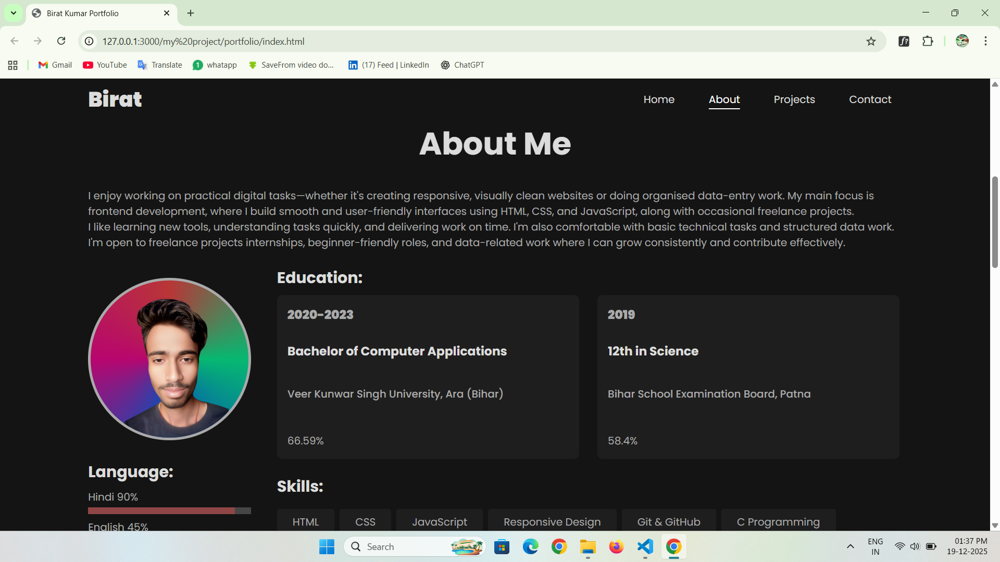
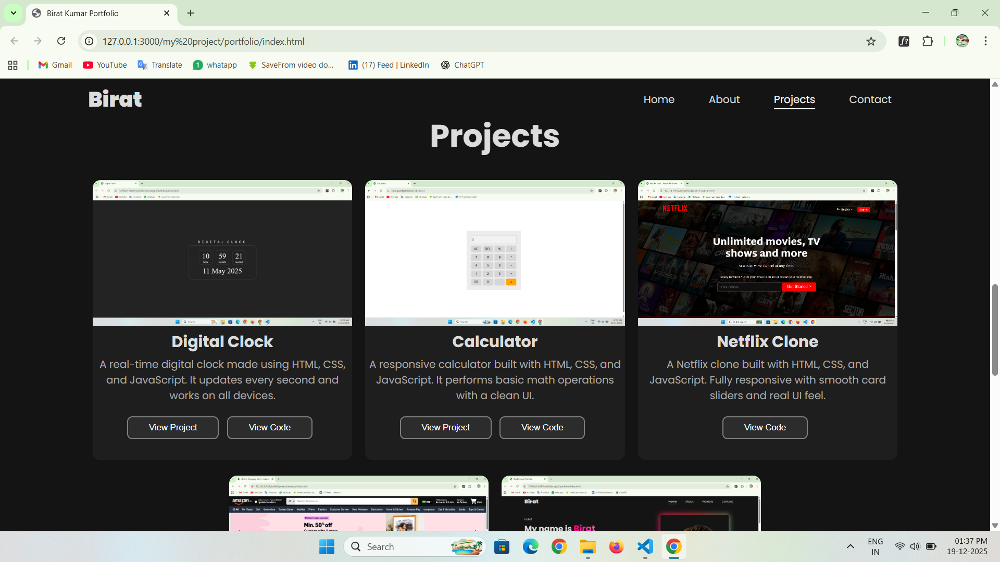
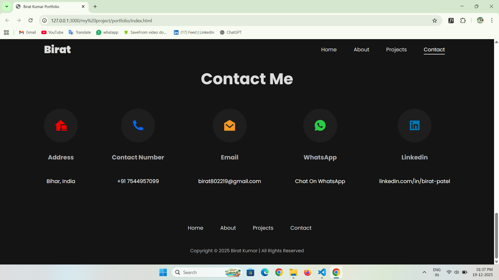
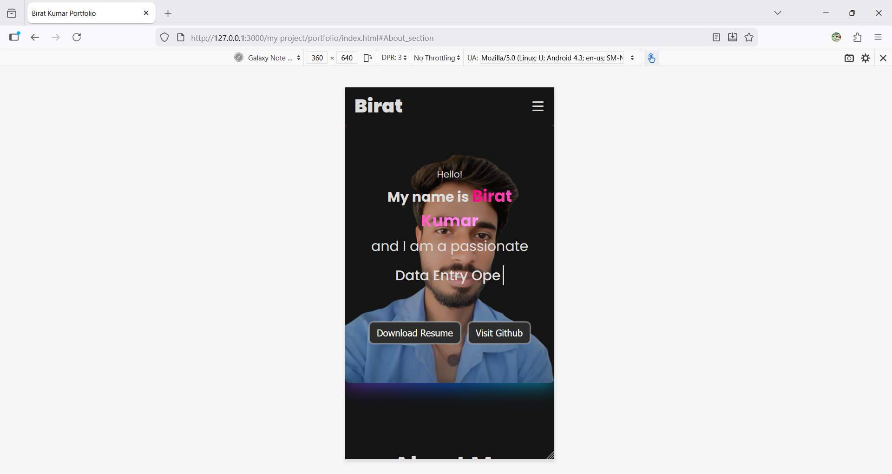

# Birat Kumar – Portfolio Website

Personal portfolio website built using HTML, CSS, and JavaScript.  
This website showcases my skills, projects, and contact information in a clean and responsive layout.

Live Website:  
https://birat-patel.github.io/

---

## Features

- Clean and modern UI design
- Fully responsive layout (desktop, tablet, mobile)
- Smooth navigation between sections
- Scroll-based active navigation highlighting
- Mobile-friendly menu toggle
- Organized project showcase
- Simple and readable code structure

---

## Technologies Used

- HTML5
- CSS3 
- JavaScript(ES6)
- Git & GitHub
- GitHub Pages

---

## File Structure

birat-patel.github.io/
│
├── index.html
├── style.css 
├── script.js
├── responsive.css
└── assets/
    ├── images
    └── pdf

---

## Screenshot

### Home Section


### About Section


### Project Section


### Contact Section


### Mobile Views


---

## Run Locally

```bash
git clone https://github.com/birat-patel/birat-patel.github.io.git
cd birat-patel.github.io
open index.html
```

## Author

Birat Kumar  

[](https://github.com/birat-patel)

